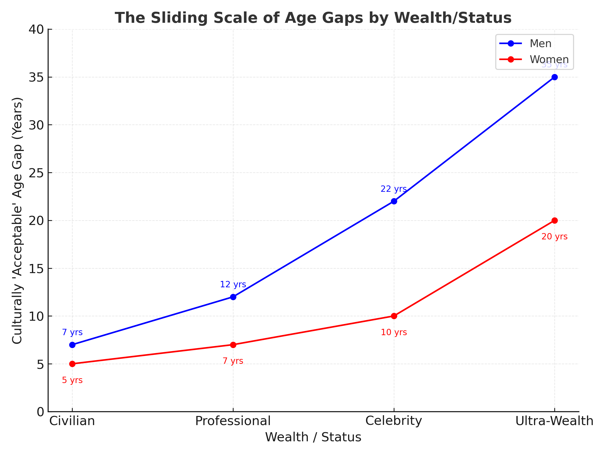

# The Sliding Scale of Age Gaps  

## A Question of Numbers  

When does an age gap look “normal” and when does it look like a spectacle?  
In everyday life, 10 years feels like the upper bound. In Hollywood, 20 years barely raises an eyebrow. In music or the billionaire class, 30–40 years isn’t uncommon.  

It isn’t the math alone — it’s a **sliding scale** powered by wealth, fame, and perception.  

---

## How Wealth Expands the Window  

For men, the pattern is consistent:  
- **Middle-class or mid-level success** → “safe” gaps of 5–10 years.  
- **High-status (actors, athletes, CEOs)** → 15–25 years becomes normalised.  
- **Ultra-wealth (billionaires, rock icons)** → 30–40 years can be reframed as glamorous.  

Wealth doesn’t erase the age difference. It acts as a buffer, turning what might look like a midlife cliché into an accepted cultural script.  

---

## When Women Hold the Power  

Historically, women have had far less license to date younger men. But this is changing.  
- **Cher & Alexander Edwards** — 40 years.  
- **Madonna & Ahlamalik Williams** — 36 years.  
- **Mariah Carey & Bryan Tanaka** — 14 years.  
- **MacKenzie Scott** — billionaire philanthropist, married a much younger teacher.  

The shift is most visible in **music**, where persona and reinvention can override conventional optics. In **business**, wealth itself grants leeway. In **film**, though, the reversal is still rare — Hollywood continues to cast “older woman with younger man” as unusual, even comic.  

---

## Perception vs Reality  

What fascinates most isn’t just the age difference, but how it’s *read*.  
- **Keanu Reeves & Alexandra Grant** — 9 years apart, but public assumed she was older because of grey hair.  
- **Brad Pitt & Ines de Ramon** — 29 years apart, but softened by grooming and aura.  
- **Leonardo DiCaprio & Vittoria Ceretti** — 23 years apart, exaggerated by Leo’s drift into Nicholson territory.  

It’s often **optics, not arithmetic**, that drive judgment.  

---

## Archetypes of Aging  

Male stars especially fall into cultural archetypes that colour their relationships:  
- **The Nicholson** — excess and indulgence (DiCaprio, Depp).  
- **The Clooney** — graceful maturity (Pitt, Clooney).  
- **The Keanu** — minimalist, peer-like (Reeves).  
- **The Outlaw** — messy, erratic (Depp, Quaid).  
- **The Civilian** — grounded, low-drama (Bale, Day-Lewis).  

Each archetype bends the way we read the gap.  

---

## The Sliding Scale, Visualised  

Here’s the pattern made visible:  

  

- For **men**, the “acceptable” age gap expands steeply with wealth and status — from ~7 years at the civilian level to ~35 years at the billionaire/rockstar tier.  
- For **women**, it stays flat for most of the scale, only starting to climb in music and business at the top end — up to ~20 years.  

---

## What It Really Shows  

Age gaps in celebrity culture reveal less about biology and more about **power, optics, and storytelling**.  
- A 10-year gap in suburbia raises whispers.  
- A 30-year gap in Malibu looks like branding.  
- A 9-year gap where the woman looks like a peer gets read as radical.  

It’s not the years. It’s the *frame*.  
